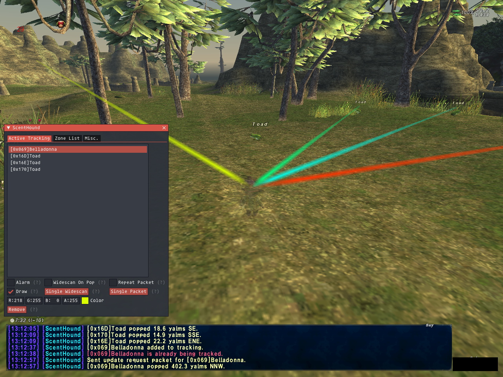

# Scenthound
Scenthound is an addon designed to aid in monster camping. It can also be used to rapidly identify NPC locations, whether or not they are nearby.

# Warning - PACKET FUNCTIONS ARE DANGEROUS
The packet functions included in this addon are present because they are now commonplace on Windower and have been widely used in Sortie. They are unambiguously cheating, and you will risk your account if you use them. Because of this, they are disabled by default. To enable them, you must check the 'Packet Search' checkbox in the misc tab of the UI.

# How to Use
Type '/sc' or '/scenthound' to open the config UI. Use the zone list tab to locate the monster you're interested in. If the formatting is not what you expect, the misc. tab allows you to change between ID/Index and decimal/hex. Select your monster, add an alias if desired, and click track to add it to active tracking. Under the active tracking tab, you can select which kind of alerts you'd like. Each feature is described here.

# Alarm
This will play a sound when the monster is detected.

# Draw
This will draw a beam from your character to the monster to indicate the location. If enabled, you can also customize the color for each monster.

# Widescan on Pop
This requires that you have the 'watchdog' addon loaded for widescan. It will immediately track the mob on widescan when the monster pops.

# Single Widescan
This makes one attempt to track the mob using the 'watchdog' addon. It will only work if the monster is currently up in the zone.

# Repeat Packet
This will periodically send packets to ask the server where the monster is. This allows you to detect a monster that is more than 50' away as soon as it pops. This is the riskiest function in the addon and should be used with extreme caution. It will not be available unless you have enabled 'Packet Search' on the misc. tab.

# Single Packet
This will send a single packet to the server to ask where the monster is. This can be used to rapidly locate NPCs such as bitzers, warhorse hoofprint, etc. Again, this is risky and will not be available unless you have enabled 'Packet Search'.